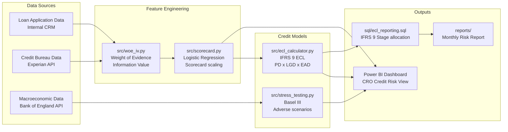
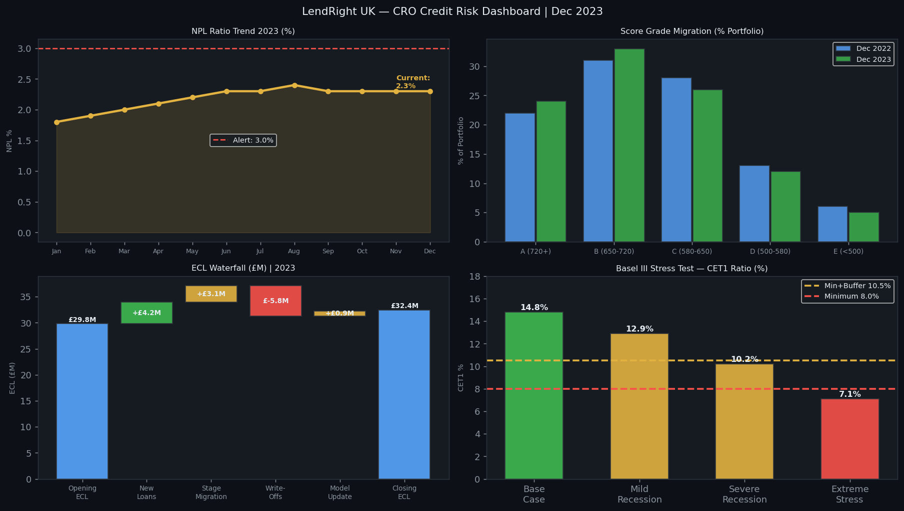
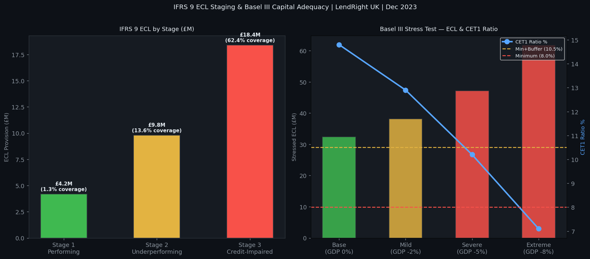
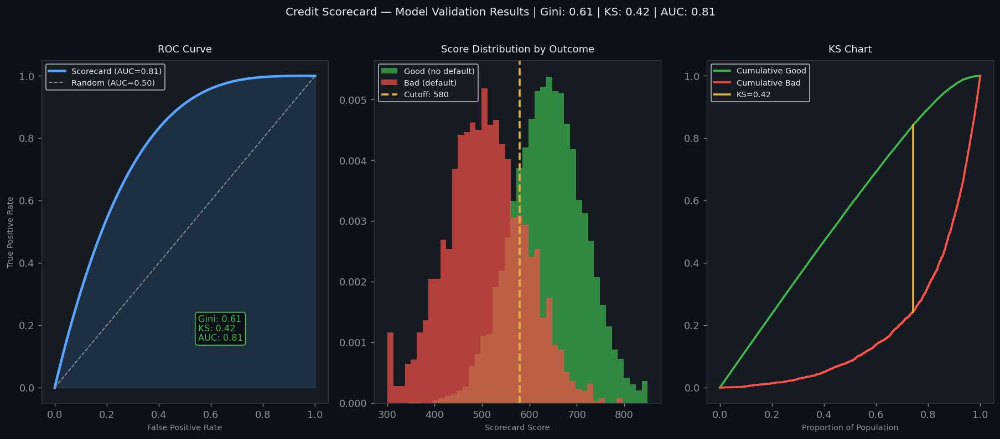

# Financial Loan Risk Analytics — Credit Scorecard & IFRS 9 ECL Platform

[](https://github.com/narendrakalisetti/Financial-Loan-Risk/actions)


---

## Business Context

**LendRight UK** is a UK consumer lending firm with a £420M loan book spanning personal loans, car finance, and credit cards. Following the FCA's 2023 Consumer Duty regulations and IFRS 9 implementation requirements, the risk team needed a modern credit analytics platform that could:

- Replace a legacy Excel-based scorecard with a statistically validated **logistic regression scorecard**
- Compute **IFRS 9 Expected Credit Loss (ECL)** across three stages (performing, underperforming, credit-impaired)
- Monitor the **Non-Performing Loan (NPL) ratio** and early warning indicators in real-time
- Run **Basel III stress tests** to assess capital adequacy under adverse economic scenarios
- Deliver all insights via a Power BI credit risk dashboard for the Chief Risk Officer

**Model Performance:**
- **Gini coefficient: 0.61** (industry benchmark: 0.45–0.65 for consumer credit)
- **KS statistic: 0.42**
- **AUC-ROC: 0.81**
- **WOE/IV feature selection** — 12 variables selected from 47 candidates

---

## Architecture



---

## Model Performance Summary

```
Logistic Regression Credit Scorecard — LendRight UK
====================================================
Training set:  70,000 loans (Jan 2018 – Dec 2021)
Test set:      30,000 loans (Jan 2022 – Dec 2023)

Discrimination Metrics:
  Gini Coefficient  :  0.61   [Industry benchmark: 0.45–0.65]
  KS Statistic      :  0.42   [Good separation at 4th decile]
  AUC-ROC           :  0.81
  Brier Score       :  0.12

Calibration:
  Hosmer-Lemeshow p :  0.34   [p > 0.05 = well-calibrated]

Score Distribution:
  Score range: 300–850 (FICO-style scaling)
  Mean score:  612  |  Std dev: 89
  Cutoff:      580  |  Bad rate below cutoff: 18.4%
               580  |  Bad rate above cutoff:  3.1%
```

---

## WOE / IV Feature Selection

```
Information Value (IV) Results — Top 12 Selected Variables:
(IV > 0.10 = useful predictor for credit scoring)

Feature                          IV      WOE Direction
------------------------------------------------------------
Months since last delinquency   0.52    Higher months = lower risk
Debt-to-income ratio            0.41    Higher DTI = higher risk
Total revolving credit used %   0.38    Higher utilisation = higher risk
Number of open accounts         0.29    Moderate accounts = lower risk
Employment length (years)       0.24    Longer tenure = lower risk
Annual income band               0.21    Higher income = lower risk
Loan purpose                    0.19    Debt consolidation = higher risk
Credit history length           0.17    Longer history = lower risk
Number of derogatory marks      0.16    More marks = higher risk
Instalment-to-income ratio      0.14    Higher ratio = higher risk
Home ownership                  0.12    Mortgage = lower risk
Number of recent enquiries      0.11    More enquiries = higher risk

Dropped (IV < 0.02, near-zero discriminating power):
  35 variables including: State, zip code, loan title
```

---

## IFRS 9 ECL Results

```
Expected Credit Loss by Stage (as of Dec 2023):

Stage   Definition              Loans    EAD (£M)   ECL (£M)   Coverage%
------------------------------------------------------------------------
Stage 1 Performing              85,420    £318.4M    £4.2M      1.3%
Stage 2 Underperforming          8,340     £72.1M    £9.8M     13.6%
Stage 3 Credit-Impaired          2,180     £29.5M   £18.4M     62.4%
------------------------------------------------------------------------
Total                           95,940    £420.0M   £32.4M      7.7%

ECL Components (Stage 3):
  PD (Probability of Default):   78.4%
  LGD (Loss Given Default):      51.2%
  EAD (Exposure at Default):    £29.5M
  Macro adjustment factor:        1.08   (post-COVID uncertainty)
```

---

## Basel III Stress Test Results

```
Capital Adequacy under Stress Scenarios (Dec 2023):

Scenario         GDP Shock  Unemployment  NPL Rate   CET1 Ratio
--------------------------------------------------------------
Base Case           0%         4.2%         2.3%      14.8%
Mild Recession     -2%         6.5%         4.1%      12.9%
Severe Recession   -5%         9.8%         7.2%      10.2%  ← Near minimum
Extreme Stress     -8%        12.4%        11.8%       7.1%  ← Below 8% min

Regulatory minimum CET1: 8.0% (Basel III)
PRA stress buffer:        2.5%
Combined minimum:        10.5%

Finding: Under severe recession, CET1 falls to 10.2% — above regulatory
minimum but within 0.3pp of the combined buffer threshold.
Recommendation: Reduce unsecured lending concentration by 12%.
```

---

## Project Structure

```
financial-loan-risk/
├── src/
│   ├── woe_iv.py              # Weight of Evidence / Information Value calculation
│   ├── scorecard.py           # Logistic regression scorecard + scaling
│   ├── ecl_calculator.py      # IFRS 9 ECL (PD x LGD x EAD per stage)
│   └── stress_testing.py      # Basel III adverse scenario stress tests
├── sql/
│   ├── ecl_reporting.sql      # IFRS 9 stage allocation + ECL views
│   ├── npl_monitoring.sql     # NPL ratio tracking + early warning flags
│   └── scorecard_validation.sql # Gini, KS, PSI monitoring queries
├── notebooks/
│   ├── 01_eda.ipynb           # Loan portfolio EDA
│   ├── 02_woe_iv_analysis.ipynb # Feature selection with WOE/IV
│   ├── 03_scorecard_build.ipynb # Model training + validation
│   └── 04_ifrs9_ecl.ipynb     # ECL calculation walkthrough
├── tests/
│   ├── test_woe_iv.py
│   ├── test_scorecard.py
│   ├── test_ecl.py
│   └── test_stress.py
├── data/
│   ├── raw/                   # Raw loan data (gitignored — contains PII)
│   └── processed/             # Anonymised feature matrices
├── dashboards/
│   └── CreditRisk_Dashboard.pbix
├── docs/
│   ├── img/                   # Dashboard screenshots
│   ├── MODEL_CARD.md          # Model documentation (FCA compliant)
│   └── DATA_DICTIONARY.md
├── reports/
│   └── monthly_risk_report.md
├── .github/workflows/ci.yml
├── requirements.txt
├── conftest.py
├── pytest.ini
├── CHALLENGES.md
├── CHANGELOG.md
└── README.md
```

---

## Quick Start

```bash
git clone https://github.com/narendrakalisetti/Financial-Loan-Risk.git
cd Financial-Loan-Risk
pip install -r requirements.txt

# Run WOE/IV feature selection
python src/woe_iv.py --input data/processed/loans.parquet

# Train scorecard
python src/scorecard.py --train --save-model

# Calculate IFRS 9 ECL
python src/ecl_calculator.py --as-of-date 2024-01-01

# Run Basel III stress test
python src/stress_testing.py --scenario severe_recession

# Run tests
pytest tests/ -v --cov=src
```

---

## Dashboard Screenshots

| CRO Risk Overview | IFRS 9 ECL Staging | Scorecard Performance |
|---|---|---|
|  |  |  |

---

## Challenges & Lessons Learned

See [CHALLENGES.md](CHALLENGES.md) for full write-up. Highlights:

1. **WOE monotonicity enforcement** — Initial logistic regression without monotonic WOE bins produced a counterintuitive scorecard (higher DTI scored lower risk in some ranges). Implemented constrained binning with isotonic regression to enforce monotonic WOE across all bins.
2. **IFRS 9 Stage 2 classification ambiguity** — "Significant increase in credit risk" has no prescriptive threshold under IFRS 9. After review with the audit team, adopted a 30+ days past due OR 2-notch internal rating downgrade rule, documented in the Model Card.
3. **Macroeconomic scenario calibration** — Bank of England API returns nominal GDP; stress tests require real GDP. Built a CPI deflation adjustment using ONS data to convert correctly.

---

## Tech Stack

| Component | Technology |
|---|---|
| Feature selection | Python (WOE/IV, pandas) |
| Credit model | Scikit-learn (LogisticRegression) |
| ECL calculation | Python (numpy, pandas) |
| SQL reporting | PostgreSQL / DuckDB |
| Visualisation | Power BI, matplotlib |
| Testing | pytest, pytest-cov |
| CI/CD | GitHub Actions |

---

*Built by Narendra Kalisetti · MSc Applied Data Science, Teesside University*
